# Comparing Object Detection Algorithms in MMDetection: A Study on COCO 2017 Dataset

## Abstract
Object detection is a fundamental task in computer vision with various applications, including autonomous driving, surveillance, and robotics. In this study, we evaluate several object detection algorithms within the MMDetection framework, including Sparse R-CNN, Cascade R-CNN, Faster R-CNN, Mask R-CNN, and YOLOv3, on the COCO 2017 train validation sets. We use several average precision and recall scores to evaluate the performance of each model. We also perform transfer learning using Faster R-CNN and the KITTI dataset, and develop our own implementation of the YOLOv3 network in PyTorch and demonstrate its capabilities.

## Introduction
Object detection algorithms are designed to locate and classify objects within an image. There are various object detection algorithms available in the literature, and the MMDetection framework provides a flexible platform for developing and evaluating these algorithms. In this study, we focus on evaluating five popular object detection algorithms within the MMDetection framework: Sparse R-CNN, Cascade R-CNN, Faster R-CNN, Mask R-CNN, and YOLOv3. To get to the details of this study, some fundamentals of object detection must first be covered.

### Intersection over Union (IoU)
Unlike standard computer vision classification problems, the goal of object detection is to not only detect objects in an image, but to also find where they are in that image. This is done typically through a tight bounding box enclosing the object, which encodes both location and size. To compare a ground truth bounding box to a model-predicted bounding box, we can use Intersection over Union (IoU). IoU is a commonly used metric for evaluating the performance of object detection algorithms. IoU measures the overlap between the predicted bounding box and the ground truth bounding box for a given object.

To calculate IoU, the area of intersection between the predicted and ground truth bounding boxes is divided by the area of union between the two bounding boxes. This bounds IoU between [0,1], where 1 indicates perfect overlap and 0 indicates no overlap.

$$IoU(A,B) = \frac{|A \cap B|}{|A \cup B|}$$

The paper that first introduced IoU as a metric for object detection is "Faster R-CNN: Towards Real-Time Object Detection with Region Proposal Networks" by Shaoqing Ren, Kaiming He, Ross Girshick, and Jian Sun. The paper was published in 2015 and proposed a new deep learning architecture for object detection called Faster R-CNN. The authors used IoU as a key evaluation metric to measure the accuracy of their model on the PASCAL VOC dataset. Since then, IoU has become a standard metric for evaluating object detection models.

### Average Precision (AP)
Average precision (AP) is a common evaluation metric used in object detection to measure the accuracy of predicted bounding boxes. It is a single scalar value that summarizes the precision-recall curve for a given model and dataset at different levels of IoU (typically ranging between 0.5 and 0.95). AP measures the quality of the predicted bounding boxes by computing the area under the precision-recall curve, which plots the precision (fraction of correct detections among all predicted detections) versus the recall (fraction of true objects detected among all true objects).

The average precision (AP) is defined as the average of the maximum precisions at different recall levels. This means that the AP metric penalizes models that have low precision at high recall levels, which is important in object detection because detecting all objects of interest is usually more important than detecting some objects with high precision.

### COCO Dataset
The COCO (Common Objects in Context) dataset is a large object detection dataset that was introduced in 2014. Of the 330,000 total images, each has been annotated with the classes and bounding boxes for the target objects. The dataset includes 80 different object categories, such as people, animals, vehicles, and household objects. This study will be evaluating models using the 2017 COCO train validation set in particular, which has exactly 5000 labeled images.

### YOLOv3
YOLOv3 (You Only Look Once) [3] is described as a real-time object detection algorithm that identifies specific objects in videos, live feeds, or images. This strong balance of having fast speeds and accurate predictions have made the YOLO family of algorithms to be particularly important in object detection. Their architecture is also relatively simple, making them more accessible for researchers. YOLOv3 at its core is a convolutional neural network that performs object detection by dividing an image into a grid and predicting bounding boxes and class probabilities for each grid cell. As suggested by its name, YOLOv3 is a single-stage detector, meaning it predicts the classes and locations in a single forward pass of the network. This in particular gives it its speed, however at the cost of lower accuracy.

### Faster R-CNN
Faster R-CNN [5] is a popular object detection algorithm that uses a two-stage detection process (unlike YOLOv3's one-stage) to generate region proposals and refine them using a classification and regression network. The Region Proposal Network (RPN) generates a set of candidate regions of interest in the image, while the Classifier Network labels each region as being part of a class or just the background.

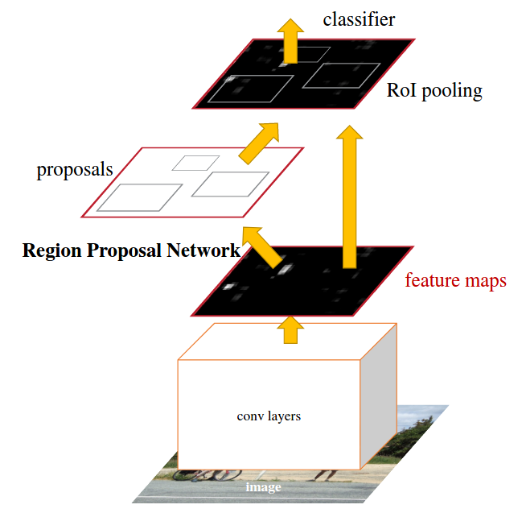

The shared feature map for the RPN and classifier networks allow Faster R-CNN to perform object detection in real-time applications while still demonstrating excellent performance.

### Mask R-CNN
Mask R-CNN [6] is an extension of Faster R-CNN that adds a segmentation branch to the network to generate object masks in addition to bounding boxes. This allows for both bounding box detections as well as instance segmentation. Although this is a dramatic improvement over Faster R-CNN in terms of use cases, we are including Mask R-CNN to see if there is a performance tradeoff (or improvement) over its predecessor.

### Sparse R-CNN
Sparse R-CNN [7] is a recently proposed object detection algorithm that uses sparse convolutional layers to reduce the computational cost of the backbone network. Sparse R-CNN achieves this by selecting features that aren't necessarily the most informational, but the ones that are most correlated with the ground truth. It also made non-trivial improvements on top of Faster R-CNN in the training scheme to improve performance.

### Cascade R-CNN
Cascade R-CNN [4] is an extension of Faster R-CNN that improves the accuracy of bounding box proposals through a multi-stage detection process. This cascade of detectors helps against degrading performance when increasing the IoU threshold. We aim to see if Cascade R-CNN improves not only its baseline AP scores above Faster R-CNN, but especially at higher IoU values such as 0.75 and above.

## Method
We use the MMDetection framework to implement and evaluate the five object detection algorithms on the COCO 2017 train validation sets. We train each model on the train set and evaluate it on the validation set using several average precision and recall scores, including AP@0.50:0.95, AP@0.50, AP@0.75, and AR@0.50:0.95.

### MMDetection Setup
To get started with MMDetection, we first need to install the necessary dependencies for any MMDetection-related project, namely [PyTorch](https://pytorch.org/). All of the Python packages used in this project are outlined in the repository's [requirements.txt](https://github.com/rudyorre/object-detection/blob/main/requirements.txt) file. In the root of the project directory, the MMDetection repository needs to be cloned:
```bash
git clone https://github.com/open-mmlab/mmdetection.git
```
All of this (plus more) is handled in our [setup script](https://github.com/rudyorre/object-detection/blob/main/setup.ipynb).

### Model Evaluation
Each model has its own evaluation script in the [`/models`](https://github.com/rudyorre/object-detection/tree/main/models) directory to make sure we didn't have to worry about any resource management issues. Our initial testing script attempted to load all of the models into memory during the same runtime which led to undefined behavior.

Each evaluation script did a handful of things:
1. Install the respective model weights
2. Select the correct config script for that model
3. Run the test script on the COCO 2017 validation set

Below is what a typical model evaluation script would look like:

```python3
# Check Pytorch installation
import torch, torchvision
print(torch.__version__, torch.cuda.is_available())

# Check MMDetection installation
import mmdet
print(mmdet.__version__)
# from mmdet.apis import multi_gpu_test, single_gpu_test

# Check mmcv installation
from mmcv.ops import get_compiling_cuda_version, get_compiler_version
print(get_compiling_cuda_version())
print(get_compiler_version())

# Weights
!curl https://download.openmmlab.com/mmdetection/v2.0/yolo/yolov3_d53_320_273e_coco/yolov3_d53_320_273e_coco-421362b6.pth -o ../mmdetection/weights/yolov3.pth

!cd ../mmdetection && python3 tools/test.py configs/yolo/yolov3_d53_320_273e_coco.py weights/yolov3.pth --eval bbox proposal --eval-options "classwise=True"
```
And the output:
```bash
+---------------+-------+--------------+-------+----------------+-------+
| category      | AP    | category     | AP    | category       | AP    |
+---------------+-------+--------------+-------+----------------+-------+
| person        | 0.384 | bicycle      | 0.194 | car            | 0.236 |
| motorcycle    | 0.317 | airplane     | 0.495 | bus            | 0.520 |
| train         | 0.534 | truck        | 0.217 | boat           | 0.125 |
| traffic light | 0.134 | fire hydrant | 0.502 | stop sign      | 0.517 |
| parking meter | 0.345 | bench        | 0.143 | bird           | 0.230 |
| cat           | 0.531 | dog          | 0.498 | horse          | 0.418 |
| sheep         | 0.333 | cow          | 0.340 | elephant       | 0.492 |
| bear          | 0.593 | zebra        | 0.535 | giraffe        | 0.550 |
| backpack      | 0.078 | umbrella     | 0.267 | handbag        | 0.073 |
| tie           | 0.173 | suitcase     | 0.223 | frisbee        | 0.469 |
| skis          | 0.122 | snowboard    | 0.139 | sports ball    | 0.283 |
| kite          | 0.290 | baseball bat | 0.157 | baseball glove | 0.235 |
| skateboard    | 0.364 | surfboard    | 0.217 | tennis racket  | 0.296 |
| bottle        | 0.188 | wine glass   | 0.190 | cup            | 0.241 |
| fork          | 0.161 | knife        | 0.063 | spoon          | 0.071 |
| bowl          | 0.266 | banana       | 0.155 | apple          | 0.124 |
| sandwich      | 0.237 | orange       | 0.186 | broccoli       | 0.154 |
| carrot        | 0.125 | hot dog      | 0.224 | pizza          | 0.346 |
| donut         | 0.334 | cake         | 0.242 | chair          | 0.171 |
| couch         | 0.323 | potted plant | 0.165 | bed            | 0.377 |
| dining table  | 0.205 | toilet       | 0.511 | tv             | 0.422 |
| laptop        | 0.438 | mouse        | 0.448 | remote         | 0.108 |
| keyboard      | 0.343 | cell phone   | 0.198 | microwave      | 0.407 |
| oven          | 0.255 | toaster      | 0.089 | sink           | 0.251 |
| refrigerator  | 0.445 | book         | 0.055 | clock          | 0.360 |
| vase          | 0.241 | scissors     | 0.205 | teddy bear     | 0.322 |
| hair drier    | 0.030 | toothbrush   | 0.090 | None           | None  |
+---------------+-------+--------------+-------+----------------+-------+

Average Precision  (AP) @[ IoU=0.50:0.95 | area=   all | maxDets=100 ] = 0.304
Average Precision  (AP) @[ IoU=0.50      | area=   all | maxDets=1000 ] = 0.564
Average Precision  (AP) @[ IoU=0.75      | area=   all | maxDets=1000 ] = 0.296
Average Precision  (AP) @[ IoU=0.50:0.95 | area= small | maxDets=1000 ] = 0.111
Average Precision  (AP) @[ IoU=0.50:0.95 | area=medium | maxDets=1000 ] = 0.364
Average Precision  (AP) @[ IoU=0.50:0.95 | area= large | maxDets=1000 ] = 0.540
Average Recall     (AR) @[ IoU=0.50:0.95 | area=   all | maxDets=100 ] = 0.415
Average Recall     (AR) @[ IoU=0.50:0.95 | area=   all | maxDets=300 ] = 0.415
Average Recall     (AR) @[ IoU=0.50:0.95 | area=   all | maxDets=1000 ] = 0.415
Average Recall     (AR) @[ IoU=0.50:0.95 | area= small | maxDets=1000 ] = 0.214
Average Recall     (AR) @[ IoU=0.50:0.95 | area=medium | maxDets=1000 ] = 0.487
Average Recall     (AR) @[ IoU=0.50:0.95 | area= large | maxDets=1000 ] = 0.666
```
Since these evaluation metrics are generated from inferring 5,000 images from the COCO dataset, most of these scripts took over 4 hours on an M1 Pro, while some wouldn't even take an hour. Despite the wide range of testing times, these values will not be used for analysis since they were highly volatile depending on the other background processes that were going on at the time. They are all still available for view in each script within the [`/models`](https://github.com/rudyorre/object-detection/tree/main/models) directory.

### Transfer Learning
Another avenue for exploration was to take one of these models and to apply a fine-tuning process such that it could learn a new (but adjacent) dataset, and preferrably in a short period of training time to show that transfer learning is computationally efficient. For this we chose the Faster R-CNN model since that was the greatest common denominator out of our model zoo, and the dataset we chose is the [KITTI Vision dataset](https://www.cvlibs.net/datasets/kitti/). 

This dataset is a widely used benchmark dataset for object detection, tracking, and scene understanding tasks in autonomous driving, which consists of high-resolution images and videos of real-world traffic scenes.
It contains several types of annotations, including object bounding boxes, 3D object information, and camera and laser calibration data. Some of the benefits of using this as a transfer learning dataset:
- While the KITTI dataset shares some common object classes with the COCO dataset, such as cars and pedestrians, it also includes other classes such as cyclists, trams, and trucks. This can help evaluate the model's ability to detect and classify objects that it has not encountered during training, showing its strengths to generalize for other real-world applications.
- Different annotation formats: The KITTI dataset uses a different annotation format from the COCO dataset, which can help evaluate the model's ability to adapt to different annotation formats and generalize to new datasets.
- Smaller dataset: The KITTI dataset is smaller than the COCO dataset, which means it can show that the model can learn new and unseen features with little data/training.

All of the transfer learning is done in [`transfer_learning.ipynb`](https://github.com/rudyorre/object-detection/blob/main/transfer_learning.ipynb). Before any learning is done, here are some examples from the KITTI dataset before any inference is done:

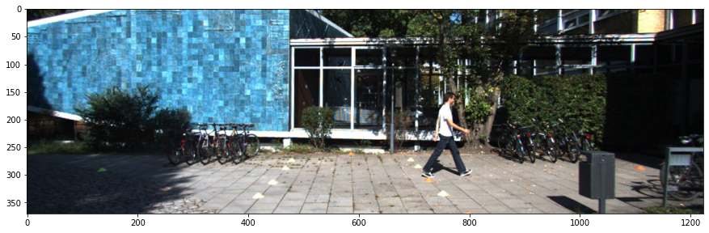
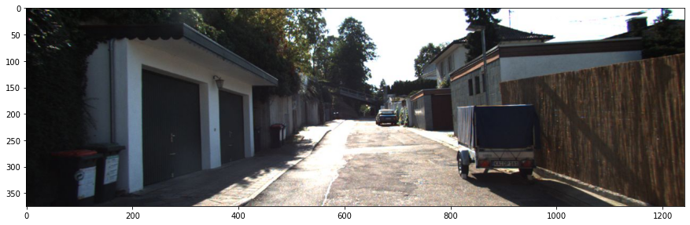
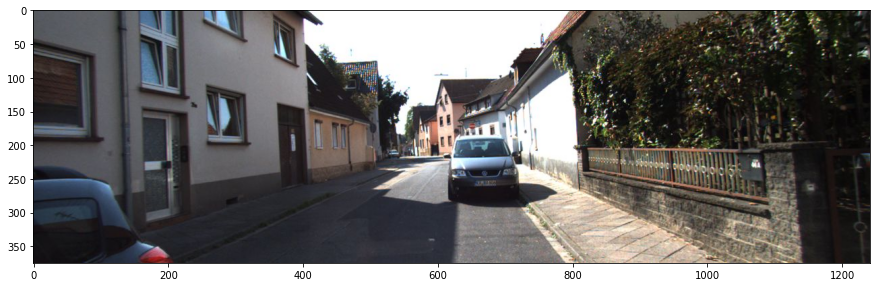

As shown, just some cars and people, and while it is similar to the larger COCO dataset, it uses a similar but different set of classes and a different annotation schema, meaning the Faster R-CNN network that is pre-trained on the COCO dataset will need to re-learn some features to be able to detect objects with this new dataset, although its pre-trained fundamentals should allow the learning to be minimal.

For the setup of the transfer learning, we had to create a custom dataset class `KittiTinyDataset` and a config script that is similar to the original Faster R-CNN config with some changes to the architecture to allow it to learn this new dataset. We are also using TensorBoard to view the training accuracy/loss over time.

### Custom YOLOv3 Implementation
For the sake of better understanding, we implemented YOLOv3 in just PyTorch (unlike the C++ Darknet versions that MMDetection uses). We were originally going to focus on the YOLO family of algorithms for this study, however we later pivoted to Faster R-CNN as it had more research and is being actively improved. We have a separate repository, [rudyorre/yolo-v3](https://github.com/rudyorre/yolo-v3), for this project since it became apparent that it wouldn't directly tie into the other aspects of this paper. The idea with this repository now is to show that with some understanding of PyTorch, it's not that difficult to understand how the YOLOv3 architecture is implemented.

Looking at the [`layers.py`](https://github.com/rudyorre/yolo-v3/blob/main/yolov3/layers.py) file, we can see that we have a lot of familiar `nn.Module` components that ultimately make up the YOLOv3 network, such as:
```python
class MaxPool(nn.Module):
    def __init__(self, kernel_size, stride=1):
        ...

    def forward(self, x):
        ...
    
class EmptyLayer(nn.Module):
    def __init__(self):
        ...

class DetectionLayer(nn.Module):
    def __init__(self, anchors):
        ...
    
    def forward(self, x, inp_dim, num_classes, confidence):
        ...
    
class Upsample(nn.Module):
    def __init__(self, stride=2):
        ...

    def forward(self, x):
        ...
    
class ReOrgLayer(nn.Module):
    def __init__(self, stride=2):
        ...

    def forward(self, x):
        ...
```
All of these modules would be integrated into the final `YOLOv3Net` class, where the `load_weights()` method would take the publically accessible pre-trained YOLOv3 weights and integrate it into the rest of the modules of the network.

Another set of non-trivial tasks that were needed was implementing custom methods for computing the bounding boxes, IoU, AP metrics, and preprocessing the image. To bring this all to life, we made a `detect.py` script that makes it easy for any to run any image they want (with varying aspect ratios!) through our network. The `metrics.ipynb` shows how this network faired in terms of its AP scores, which we will talk more about in the results section.

## Results

### Model Evaluation Results
For this task, we evaluated Faster R-CNN and its family of algorithms, as well as YOLOv3 [3], SSD [8], and RetinaNet [9] for comparison. The Faster R-CNN family consists of itself, Mask R-CNN, Sparse R-CNN, and Cascade R-CNN. For this task, we evaluated these models on the full 2017 COCO training validation set and got these results for Average Precision and Recall:

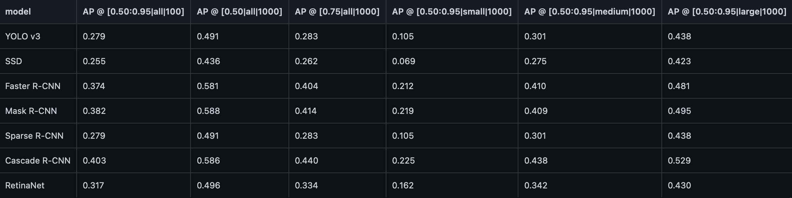
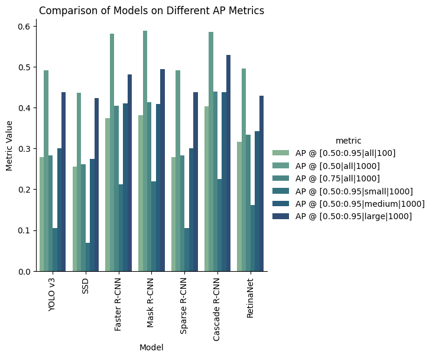
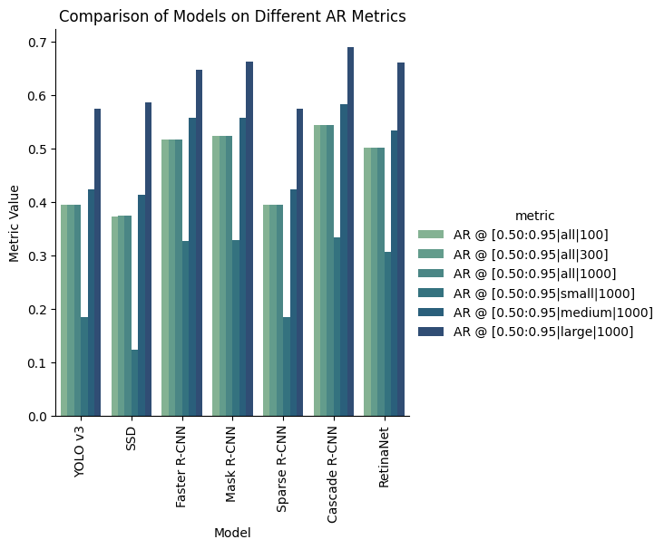

To break down the values in the square brackets, the AP/AR metrics are computed at varying IoU thresholds, detection area sizes, and max number of detections (shown as `AP @ [IoU|area|maxDet]`). 
- IoU: As explained earlier, this is to determine how much overlap there is between the prediction and ground truth bounding boxes. A good default used here is 0.5, however we also use 0.75 as well as an average between 0.5 and 0.95 for these results to see how accurate the models can get at varying precisions.
- Area: The size categories (small/medium/large) is somewhat subjective, however the standard for COCO is:
  - Small objects: bounding box area less than 32^2 pixels
  - Medium objects: bounding box area between 32^2 and 96^2 pixels
  - Large objects: bounding box area greater than 96^2 pixels
- Max Detections: For all the datasets used in this study, the max number detections made in an image doesn't really matter, since it is typically used for evaluating performance on crowded vs uncrowded images (in the range 100-1000 unique objects), so we can safely ignore this part of the results.

The metric that tells us most however are the fundamental AP scores. The following plot shows the various models with just three different IoU scores (ignoring area and max detections):
- AP @ IoU=0.50:0.95: This metric computes the average precision (AP) over a range of IoU thresholds from 0.50 to 0.95,which gives us an overall measure of the model's performance across a range of IoU values.
- AP @ IoU=0.50: This metric computes the AP at a fixed IoU threshold of 0.50, which is typically used as the default and minimal) IoU thresholds for evaluating models.
- AP @ IoU=0.75: This threshold is commonly used in tasks where higher precision is required.

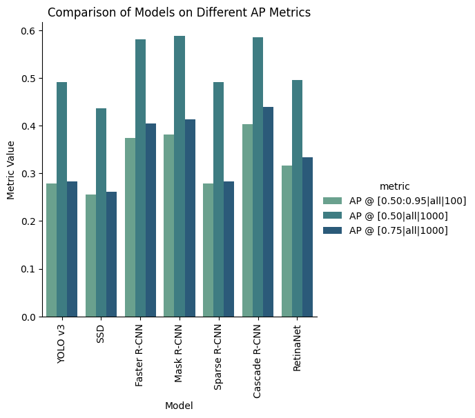

What we can extract from this data is that Cascade R-CNN is the overall winner, having the highest values for all three metrics (roughly tied with Faster and Mask R-CNN). Mask-RCNN barely inches out as the highest IoU=0.50 score, however it is within the degree of error. Despite the similar scores for these three models for the IoU=0.50 threshold score, we can see the incremental improvements from Faster, Mask, then Cascade R-CNN in terms of the other AP scores, which tells us that the Faster R-CNN framework likely caps out around 60% AP:0.5, however there is still room for improvement in terms of precision, which Mask and Cascade both are able to improve on.

Another takeaway is that Sparse R-CNN didn't perform as hot as the rest of the Faster R-CNN algorithms, however this could be due to the fact that Sparse R-CNN wasn't created necessarily to outperform what already existed, but its main goal was to improve the computational efficiency of Faster R-CNN, which unfortunately isn't something that is encoded in a performance-based evaluation such as this study. However, we can see the effects of Sparse R-CNN directly through the size of its weights.

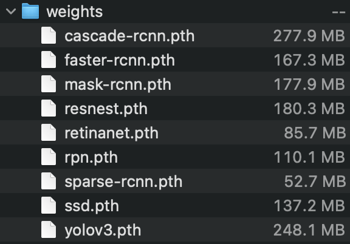

Pictured above are the weight files of the various models used in this project, and we can see that Faster R-CNN comes in at 167 MB, Mask at 177 MB, and Cascade comes at a whopping 277 MB. This is likely due to the fact that each model increases performance of the predecessor by adding more features in the architecture, where Mask adds a parallel masking branch and Cascade adds multiple stages of detectors. The Sparse R-CNN however comes it at only 52 MB, which is less than a third of the original Faster R-CNN. What was surprising to see at 248 MB is the YOLOv3 network, however this could be due to the fact that YOLO's architecture is a lot simpler, but compensates for this through scaling up the size of its components to even compete with R-CNN models.

### Transfer Learning Results
Moving on, transfer learning of the Faster R-CNN model on the KITTI dataset was a success. Below are some of the plots generated using TensorBoard:

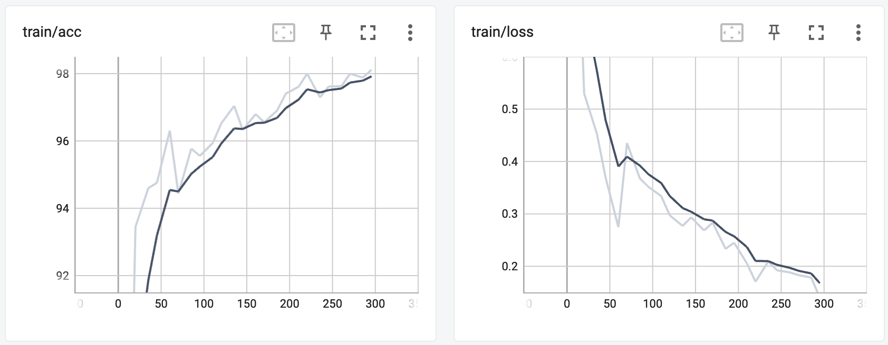
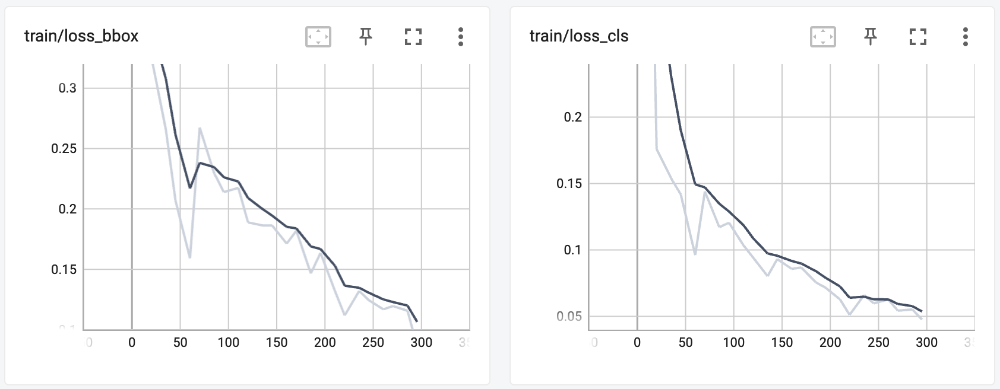
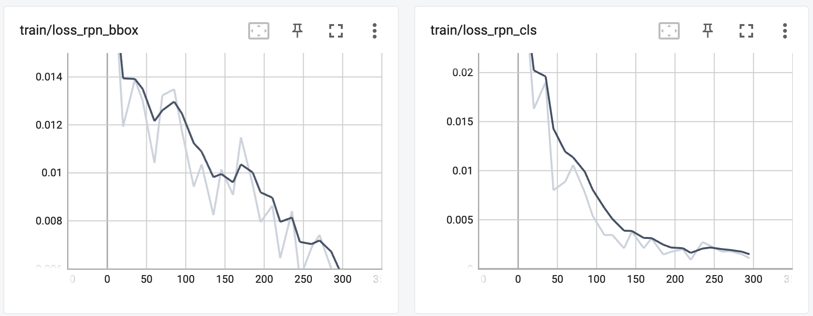

As mentioned before, since Faster R-CNN is comprised of a regular classifier network and a region proposal network, we are able to view the loss values while training for both networks and they both dramatically drop. We can see the accuracy success shown also through the final Average Precision scores for each of the classes, as well as the mean of these scores (mAP) (note that these are using an IoU=0.50):
```
+------------+-----+------+--------+-------+
| class      | gts | dets | recall | ap    |
+------------+-----+------+--------+-------+
| Car        | 62  | 131  | 0.968  | 0.872 |
| Pedestrian | 13  | 42   | 0.846  | 0.752 |
| Cyclist    | 7   | 50   | 0.429  | 0.101 |
+------------+-----+------+--------+-------+
| mAP        |     |      |        | 0.575 |
+------------+-----+------+--------+-------+
```
What is worth noting is that cars are already in the COCO dataset, so the pre-trained weights of the Faster R-CNN model were able to very accurately detect cars (AP=0.872). Slightly below would be the pedestrians, with an AP of 0.752. We reasoned that this is slightly lower because humans are typically smaller in images, and thus are more difficult to detect with high precision. On top of that, the dataset has a lot more cars than humans by its very nature, which could skew these accuracies. What stands out here is the cyclist AP of 0.101, which is drastically lower than the other two classes. This is because cyclists are a new class for this network entirely, since it isn't included in the COCO dataset. Despite this, it was still (sort of) able to detect cyclists. Given the short training time, we believe this is a good result and demonstrates that transfer learning doesn't require excessive computations to learn new objects.

Enough about scores, we can see the success of this training directly on the KITTI images shown earlier:

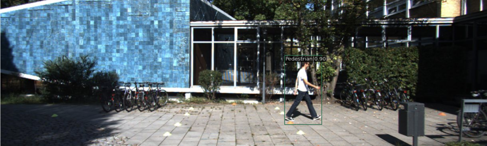
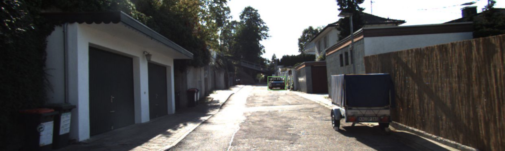
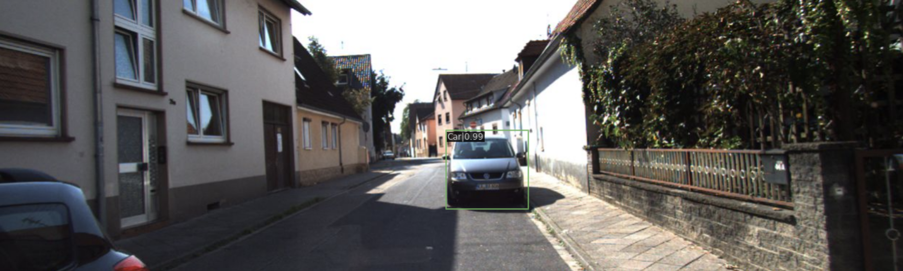

Below is an image off of Wikimedia to demonstrate detecting on non-KITTI image:

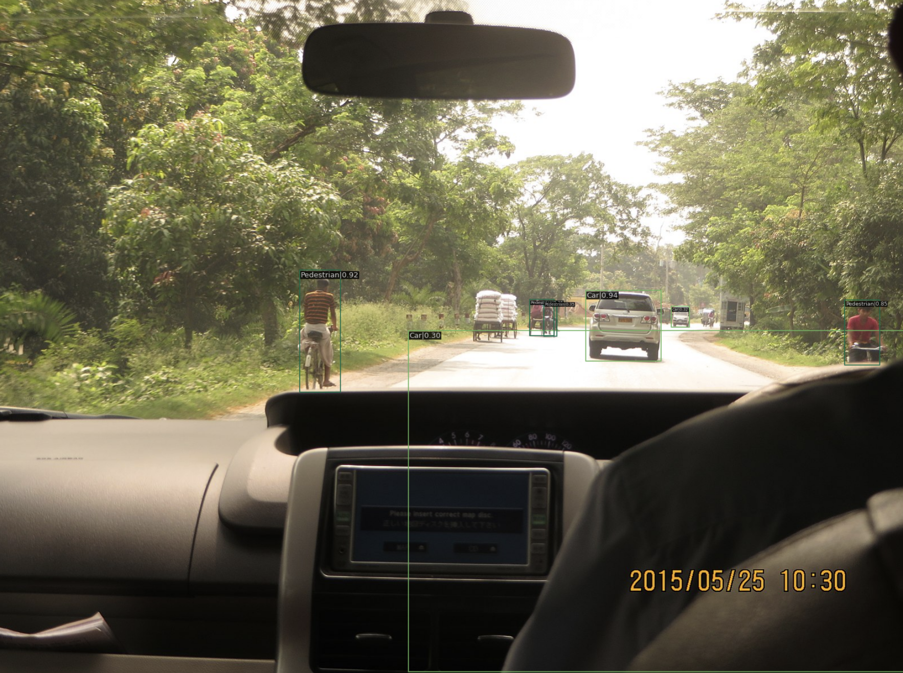

We can see that incorrectly classifies cyclists as pedestrians in this instance, which makes sense given that it is still a human pictured so it isn't necessarily wrong in terms of the COCO dataset, it just means it needs to train more to distinguish pedestrians and cyclists.

<iframe
    width="640"
    height="480"
    src="https://youtu.be/6sSBOqTmjZU"
    frameborder="0"
    allow="autoplay; encrypted-media"
    allowfullscreen
>
</iframe>

This video shows how this technique could be applied to a car camera, signalling to the driver or AI of its surroundings, especially as they get near.

### Custom YOLOv3 Results
The custom YOLOv3 model was able to achieve a mean Average Precision of 0.539 on the COCO dataset, which is honestly really good given that the MMDetection's YOLOv3 scored a 0.564. They are based on the same architecture outlined in the original YOLOv3 paper, however the vastly different frameworks each were developed in definitely could constitute a difference in performance. While our implementation of YOLOv3 scores slightly less than the C++ DarkNet version that MMDetection uses, we still consider this an innovation as it vastly simplifies the architecture through PyTorch's more readable API.

```python
from metrics import mean_average_precision

mean_average_precision(
    pred_boxes=preds,
    true_boxes=target,
    iou_thresh=0.5,
    box_format='corners',
    num_classes=len(classes)
)
```
```
tensor(0.5391)
```

Here are some examples of what our version of YOLOv3 infers from images:
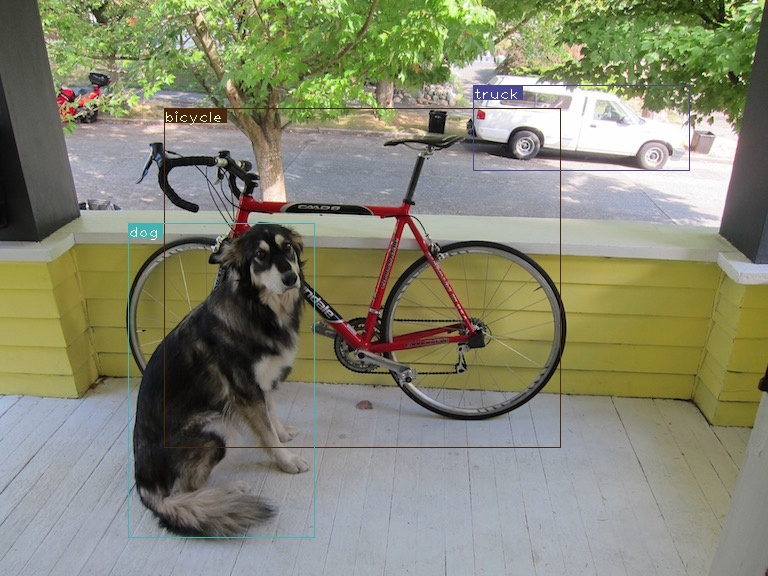
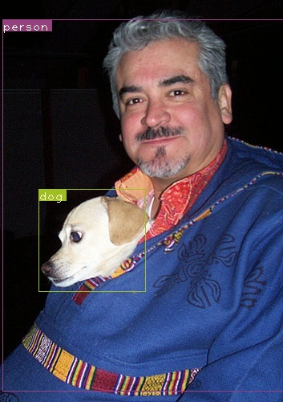

## Discussion
Analysis was done within the results section, along with any hypotheses we had from the results.

### Code
1. Object Detection Repository (Main) - [https://github.com/rudyorre/object-detection](https://github.com/rudyorre/object-detection)
2. YOLOv3 Network - [https://github.com/rudyorre/yolo-v3](https://github.com/rudyorre/yolo-v3)

### Three Relevant Papers
- 'MMDetection: Open MMLab Detection Toolbox and Benchmark' [Code](https://github.com/open-mmlab/mmdetection) [Paper](https://arxiv.org/abs/1906.07155) [1]
- 'SSD: Single Shot MultiBox Detector' [Code](https://github.com/sgrvinod/a-PyTorch-Tutorial-to-Object-Detection) [Paper](https://arxiv.org/abs/1512.02325) [2]
- 'Real Time Object/Face Detection Using YOLO-v3' [Code](https://github.com/shayantaherian/Object-detection) [Paper](https://pjreddie.com/media/files/papers/YOLOv3.pdf) [3]

## Reference
[1] Chen, K., Wang, J., Pang, J., Cao, Y., Xiong, Y., Li, X., Sun, S., Feng, W., Liu, Z., Xu, J., Zhang, Z., Cheng, D., Zhu, C., Cheng, T., Zhao, Q., Li, B., Lu, X., Zhu, R., Wu, Y., … Lin, D. (2019, June 17). MMDetection: Open mmlab detection toolbox and benchmark. arXiv.org. Retrieved January 29, 2023, from https://arxiv.org/abs/1906.07155.

[2] Liu, W., Anguelov, D., Erhan, D., Szegedy, C., Reed, S., Fu, C.-Y., & Berg, A. C. (2016, December 29). SSD: Single Shot Multibox Detector. In ECCV. Retrieved January 29, 2023, from https://arxiv.org/abs/1512.02325.

[3] Redmon, J., & Farhadi, A. (2018). YOLOv3: An Incremental Improvement. arXiv preprint arXiv:1804.02767. Retrieved January 30, 2023, from https://arxiv.org/abs/1804.02767.

[4] Cai, Z., & Vasconcelos, N. (2019). Cascade R-CNN: High Quality Object Detection and Instance Segmentation. IEEE Transactions on Pattern Analysis and Machine Intelligence, 41(12), 2978–2992. https://doi.org/10.1109/tpami.2019.2956516.

[5] Ren, S., He, K., Girshick, R., & Sun, J. (2017). Faster R-CNN: Towards Real-Time Object Detection with Region Proposal Networks. IEEE Transactions on Pattern Analysis and Machine Intelligence, 39(6), 1137–1149. https://doi.org/10.1109/tpami.2016.2577031.

[6] He, K., Gkioxari, G., Dollar, P., & Girshick, R. (2017, October). Mask R-CNN. In 2017 IEEE International Conference on Computer Vision (ICCV) (pp. 2980-2988). IEEE. https://doi.org/10.1109/ICCV.2017.322.

[7] Peize Sun, Rufeng Zhang, Yi Jiang, Tao Kong, Chenfeng Xu, Wei Zhan, Masayoshi Tomizuka, Lei Li, Zehuan Yuan, Changhu Wang, Ping Luo. "SparseR-CNN: End-to-End Object Detection with Learnable Proposals." arXiv preprint arXiv:2011.12450 (2020).

[8] Wei Liu, Dragomir Anguelov, Dumitru Erhan, Christian Szegedy, Scott Reed, Cheng-Yang Fu, Alexander C. Berg. "SSD: Single Shot MultiBox Detector." ECCV (2016).

[9] Tsung-Yi Lin, Priya Goyal, Ross Girshick, Kaiming He, Piotr Dollár. "Focal Loss for Dense Object Detection." Proceedings of the IEEE International Conference on Computer Vision (ICCV) (2017).